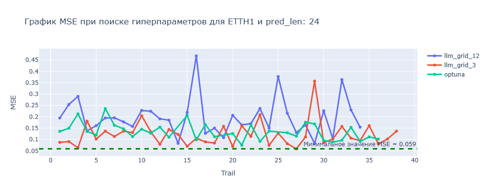
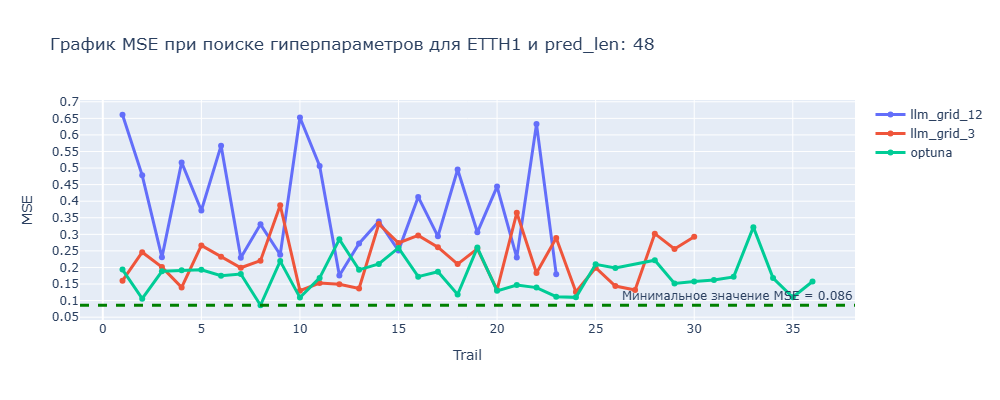
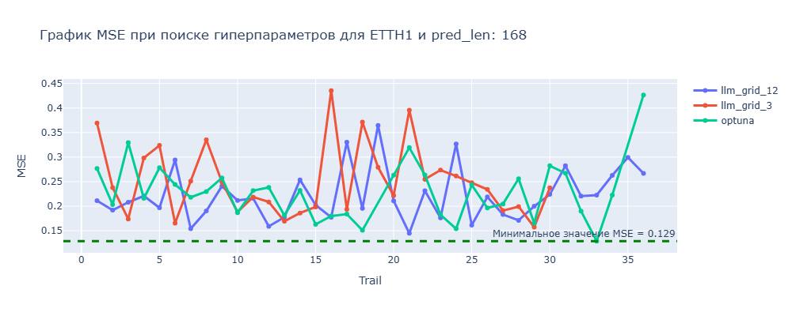
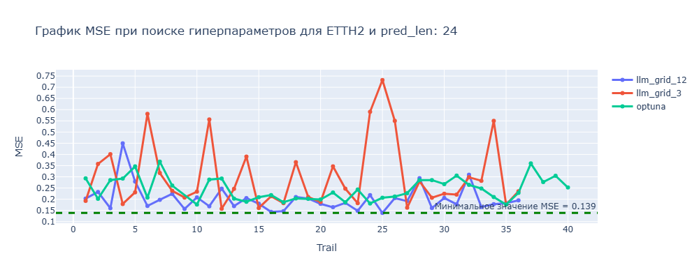
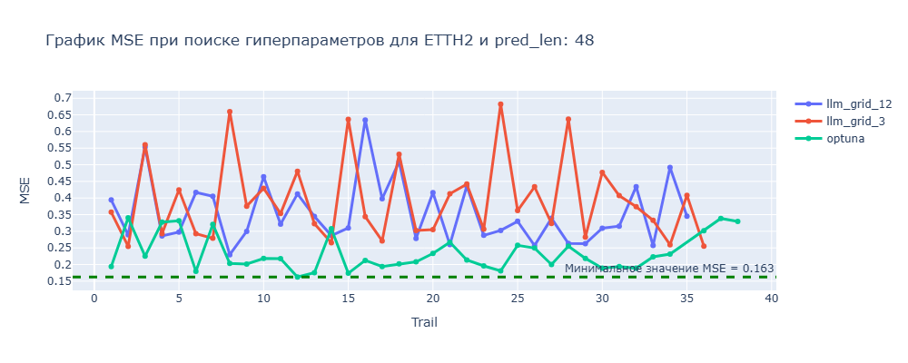
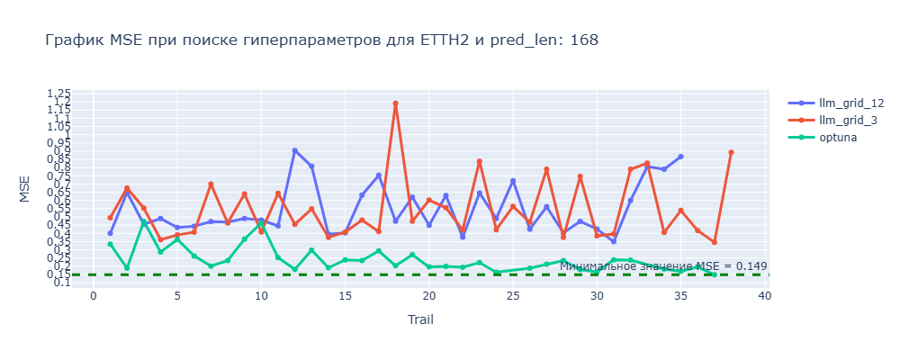

# LLM-Driven Hyperparameter Optimization для Informer

Автоматическая оптимизация гиперпараметров модели Informer с использованием LLM (Gemini).

## Ключевая идея

Проект комбинирует стандартный pipeline обучения Informer (модель для прогнозирования временных рядов) и инструментальную обвязку, которая:
- генерирует кандидатные конфигурации (архитектура + гиперпараметры) с помощью LLM;
- обучает и валидацирует каждую конфигурацию на выбранном горизонте прогноза (pred_len);
- ведёт журнал экспериментов и выбирает лучшие конфигурации.

Это упрощает поиск рабочих конфигураций без полного перебора вручную.

## Структура репозитория

Корневые файлы и папки (с кратким описанием):

- `pyproject.toml`, `uv.lock` — метаданные/лок файлы для зависимостей (используйте poetry или pip-tools по желанию).
- `optimize.py` — основной скрипт/точка входа для запуска оптимизации (CLI-обёртка, см. код).
- `train.py` — вспомогательные утилиты/скрипты для обучения модели (в корне — общие функции).
- `data/` — исходные и подготовленные CSV с датасетами (`ETTh1.csv`, `ETTh1_prepared.csv`, `ETTh2.csv` и т.д.).
- `Informer2020/` — исходная реализация Informer (код модели, загрузчики данных, эксперименты).
- `informer_checkpoints/` — директория с контрольными точками обученных моделей.
- `llm_opt_toolkit/` — набор модулей для взаимодействия с LLM и управления оптимизацией:
	- `llm_requester.py` — отправка промптов в LLM и парсинг ответов (структурированный JSON-вывод);
	- `prompt_builder.py` — генерация промптов с описанием пространства поиска и истории экспериментов;
	- `optimization_journal.py` — класс для логирования, хранения и анализа результатов (JSON-журнал);
	- `optimizator.py` — основной цикл оптимизации: запросы к LLM, тренировка кандидатов, логирование;
	- `train.py` — локальная обёртка для обучения Informer с одной конфигурацией.
- `experiments/` — записи и журналы проведённых оптимизаций (структура по датасетам и запускам).
- `results/` — результаты экспериментов (метрики, графики).
- `image/` — предгенерированные графики/визуализации.
- Jupyter ноутбуки: `analize_result.ipynb`, `nas-informer.ipynb`, `test_functions.ipynb` — примеры использования и анализ результатов.

## Схема работы


## Результаты тестирования

### Датасет ETTH1
<details>
  <summary>Нажмите, чтобы развернуть</summary>

#### Pred Len = 24


#### Pred Len = 48


#### Pred Len = 168


</details>

### Датасет ETTH2
<details>
  <summary>Нажмите, чтобы развернуть</summary>

#### Pred Len = 24


#### Pred Len = 48


#### Pred Len = 168


</details>

## Вывод

> Исходя из графиков видно, что `LLM` может иногда спрогнозировать более оптимальную архитектуру, но `Optuna` будет работать более стабильнее 


## Быстрый старт

```bash
# Установка зависимостей
uv sync

# Настройка API ключа
export GEMINI_API_KEY=your_api_key_here

# Запуск оптимизации
uv run optimize --dataset data/ETTh1_prepared.csv --pred_len 24 --journal exp.json --grid_name grid3
```
### Параметры
- `dataset_path` - Путь до папки с датасетом 
- `pred_len` - Фиксированный параметр длины прогноза моделью
- `journal_name` - Название файла с базой экспериментов 
- `grid_name` - Тип сетки `GRID12` или `GRID3`. По умолчанию - `GRID12`
- `n_batches` - Количество раз когда вызываем `LLM`
- `batch_size` - Размер `json` генерируемого `LLM`. Модель генерирует `batch_size` возможных архитектур `n_batches` раз. Соответственно кол-во `trails = n_batches * batch_size`
- `temperature` - Температура для `LLM`
- `thinking_budget` - Количество токенов на `раздумье` `LLM` 


## Colab пример
[Jupyter Notebook с примером оптимизации](https://colab.research.google.com/drive/1zLzTEc_KplZxM_XAheb7YOIYxHtFXiP4?usp=sharing)

## Основные компоненты

- llm_requester.py — формирует и отправляет промпты в LLM, ожидает структурированный JSON-ответ с набором конфигураций.
- prompt_builder.py — собирает промпт: пространство поисков, ограничения (например label_len < seq_len), историю прошлых экспериментов, формат вывода.
- optimization_journal.py — хранит результаты (json), умеет возвращать историю в Markdown-таблице и искать лучший результат.
- optimizator.py — цикл: получает батч от LLM → тренирует модели → логирует результаты → обновляет историю.
- train.py — модуль, запускающий обучение Informer для одной конфигурации и возвращающий метрики (MSE/MAE).


